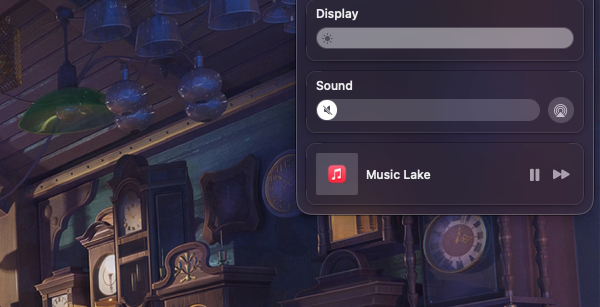

There are numerous music streaming services available, but a majority of them require paid subscriptions. I try to get rid of any subscriptions. And I'm also not a fan of storing gigabytes of music files on my laptop or any online storage.

Subsequently, I set out to discover the best ad-free alternative and eventually stumbled upon an unexpected solution.

To my surprise, iTunes has a feature that allows you to save stream URLs for later playback - internet radio! It was exactly what I had been searching for.

With this feature, there's no need to meticulously organize music into different folders or playlists. Simply add a few streams for various genres of music and you're all set.
